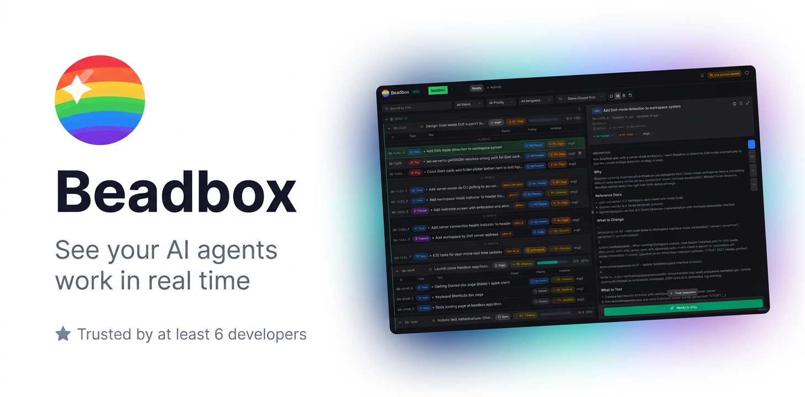

  

  <a href="https://beadbox.app">Website</a> &middot;
  <a href="https://github.com/beadbox/beadbox/blob/main/CHANGELOG.md">Changelog</a> &middot;
  <a href="https://github.com/beadbox/beadbox/issues">Issues</a>

Beadbox is a native desktop dashboard for the [beads](https://github.com/steveyegge/beads) issue tracker. It gives you real-time visibility into every task, dependency, and handoff across your AI agent fleet. Changes made in the terminal appear in the GUI within milliseconds.

## Features

- **Epic trees with progress bars** &mdash; see completion percentage across nested hierarchies at a glance
- **Real-time sync** &mdash; file-watch pipeline picks up CLI changes instantly, no polling or refresh
- **Multi-workspace** &mdash; switch between beads databases from different projects in one window
- **Inline editing** &mdash; change status, priority, assignee, and descriptions directly in the GUI
- **Filter, search, sort** &mdash; slice your backlog by status, priority, type, or assignee
- **Dependency badges** &mdash; see blocking relationships without running `bd show`
- **Dark and light themes** &mdash; follows your system preference
- **Native desktop app** &mdash; built with Tauri, not Electron. Runs on macOS, Linux, and Windows.

## Install

Download from [beadbox.app](https://beadbox.app). Available for macOS (Apple Silicon and Intel), Linux, and Windows.

Requires the [beads](https://github.com/steveyegge/beads) CLI.

## Need help?

- Open a [GitHub issue](https://github.com/beadbox/beadbox/issues)

## License

Source code is proprietary. Binary releases are free during beta.
