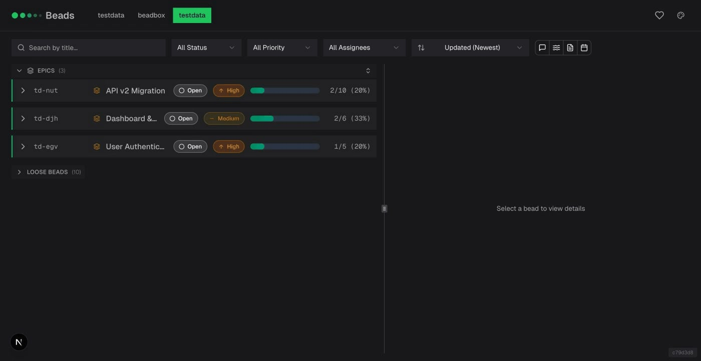

  

<h3 align="center">Beadbox</h3>

See your AI agents work in real time

  <a href="https://beadbox.app">Website</a> &middot;
  <a href="https://github.com/beadbox/beadbox/blob/main/CHANGELOG.md">Changelog</a> &middot;
  <a href="https://github.com/beadbox/beadbox/issues">Issues</a>

 

  

 

Beadbox is a native macOS dashboard for the [beads](https://github.com/nmelo/beads) issue tracker. It gives you real-time visibility into every task, dependency, and handoff across your AI agent fleet. Changes made in the terminal appear in the GUI within milliseconds.

## Features

- **Epic trees with progress bars** &mdash; see completion percentage across nested hierarchies at a glance
- **Real-time sync** &mdash; file-watch pipeline picks up CLI changes instantly, no polling or refresh
- **Multi-workspace** &mdash; switch between beads databases from different projects in one window
- **Inline editing** &mdash; change status, priority, assignee, and descriptions directly in the GUI
- **Filter, search, sort** &mdash; slice your backlog by status, priority, type, or assignee
- **Dependency badges** &mdash; see blocking relationships without running `bd show`
- **Dark and light themes** &mdash; follows your system preference
- **Native macOS app** &mdash; built with Tauri, not Electron

## Install

Download from [beadbox.app](https://beadbox.app).

## Requirements

- macOS (Apple Silicon)
- [beads](https://github.com/nmelo/beads) CLI installed (`brew install nmelo/tap/beads`)

## Need help?

- Open a [GitHub issue](https://github.com/beadbox/beadbox/issues)

## License

Source code is proprietary. Binary releases are free during beta.
