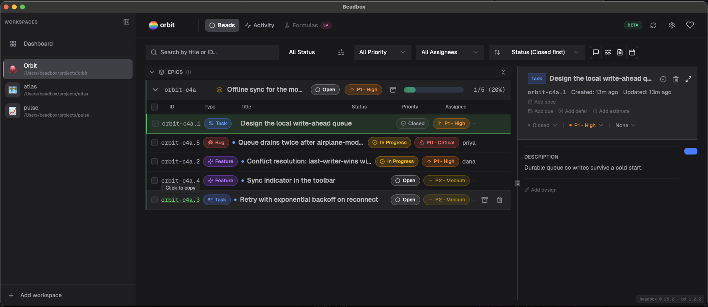
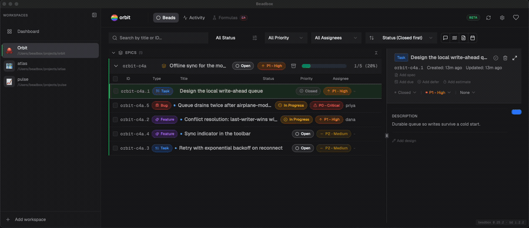

# Beadbox

> Beadbox has a sister project, [initech](https://github.com/nmelo/initech) — a runtime for agents that collaborate with each other from one terminal, optimized for steerability.
> Beadbox is built and maintained with it; worth a look.

A fast, native GUI for the [beads](https://github.com/gastownhall/beads) issue tracker.

Beadbox gives `bd` users a visual interface for the things a terminal can't show well — epic trees, dependency structure, pipeline state, and live activity — without making simple operations slower than typing `bd show`.





## Features

- **Epic tree** — hierarchical view of epics and child beads with status, priority, and progress at a glance
- **Trains** — `.beadtrain` files in the workspace `.beads/` folder: ready cars, coupler joins, click through to the bead
- **Live updates** — changes made from the `bd` CLI appear in the UI in real time; no refresh
- **Bead detail** — full descriptions, comments, dependencies, and workflow advancement in a side panel or modal
- **Filters** — slice by status, type, priority, and assignee; filters persist across sessions
- **Activity feed** — a timeline of what changed, by whom, across the workspace
- **Multi-workspace** — a rail of project tabs switches between local `.beads/` projects and remote Dolt servers; rename a tab, give it an emoji, and switching back is instant
- **Keyboard-first** — power-user paths work without touching the mouse

## Install

**Requires the [beads](https://github.com/gastownhall/beads) CLI, version 1.0.1 or newer** (`brew install beads`). Beadbox is a GUI over `bd`; issue data lives in your beads database. `.beadtrain` files in `.beads/` are optional plans (see [Beadtrains](https://github.com/acrinym/Beadtrains)) shown on the Trains tab.

### macOS

```sh
brew install --cask beadbox/cask/beadbox
```

Or download the DMG (Apple Silicon) from [Releases](https://github.com/beadbox/beadbox/releases). Builds are signed and notarized.

### Linux and Windows

Download packages from [Releases](https://github.com/beadbox/beadbox/releases).

More at [beadbox.app](https://beadbox.app).

## Build from source

Prerequisites: [Bun](https://bun.sh), [Rust](https://rustup.rs) (stable), Node.js, and the platform prerequisites for [Tauri v2](https://v2.tauri.app/start/prerequisites/).

```sh
git clone https://github.com/beadbox/beadbox.git
cd beadbox
bun install

# Run the desktop app in development
bun run tauri:dev

# Or run the web client + server without the native shell
bun run dev

# Build a release bundle
bun run tauri:build
```

To build and install a separate, locally signed macOS app without replacing
`/Applications/Beadbox.app`, run:

```sh
bash scripts/build-install-local-macos.sh
```

This installs or updates `/Applications/Beadbox Local.app` with its own bundle
identifier. The local signature is ad hoc; this build is not notarized. Launch
it with the normal Beadbox workspace registry (`~/.beadbox/registry.json`):

```sh
open -n -a "/Applications/Beadbox Local.app"
```

The local app uses the same registered Beads workspaces and installed `bd` as
the production app. Both apps can read and write those workspaces, so avoid
editing the same issue from both windows at once.

## Architecture (short version)

Beadbox is a Tauri v2 app. The Rust shell spawns a Bun sidecar process and talks to it over stdio (kkrpc). The app itself opens no network listener. The sidecar uses the `bd` CLI for writes and operations without an HTTP equivalent, and reads Dolt table hashes through SQL for server workspaces. Live updates come from watching the workspace filesystem (embedded) or polling Dolt table hashes in a separate worker (server workspaces).

An opt-in read pilot uses Beads 1.3.0 or newer to start one authenticated `bd serve` child for each actively used SQL-server workspace. Set `bdServeReads` in `~/.beadbox/config.json` (beside `registry.json`):

```json
{
  "bdServeReads": true
}
```

The setting is read on each operation; absent or invalid values leave the pilot off. `BEADBOX_BD_SERVE_READS=1` or `=0` overrides the file when explicitly set. Each child listens only on an ephemeral loopback port and is stopped with the sidecar; embedded workspaces remain on the CLI. Keep the pilot disabled until the performance and parity checks in the [workspace serve design](docs/design/bd-serve-per-workspace.md) have been run for the target environment.

For diagnosing `bd serve` failures, add `"bdServeStderrLog": true` to the same config file. This opt-in setting is checked when a `bd serve` child starts. Its stderr goes to a separate owner-only file under `~/Library/Logs/Beadbox/bd-serve/` on macOS (or the sidecar log directory on other platforms), never to the general sidecar log. Each workspace file rotates at 2 MiB with two backups; logs from stopped sidecar processes are pruned to the two most recent process runs. Beadbox masks the configured host, port, database, user, password, HTTP token, and common credential fields before writing. An existing child needs to stop and start before a changed setting takes effect.

## Contributing

See [CONTRIBUTING.md](CONTRIBUTING.md). Contributions are accepted under the MIT license — no CLA.

## Security

To report a vulnerability, see [SECURITY.md](SECURITY.md). Please don't open public issues for security reports.

## License

[MIT](LICENSE) © 2026 Nelson Melo
