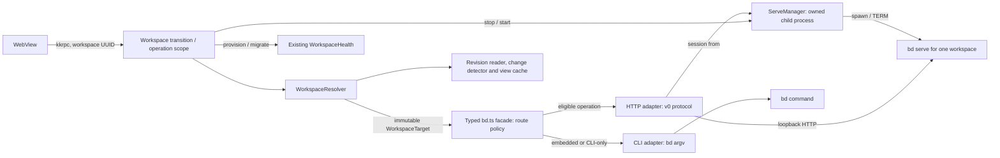

# `bd serve` для workspace Beadbox

Статус: пилот чтения реализован; план дальнейшего внедрения обновлён 2026-09-25. Контракт Beads зафиксирован по версии 1.3.0.

## Решение и границы

Beadbox запускает `bd serve` как дочерний процесс Bun sidecar для каждого **активно используемого SQL-server workspace**. Sidecar обращается к нему через loopback HTTP. Сервер обслуживает ровно один workspace; разные записи реестра не делят HTTP-процесс даже при совпадающем подключении к Dolt. Процессы запускаются по требованию, поэтому реестр из 100 workspace не создаёт 100 постоянных серверов.

Полная замена всех отдельных вызовов `bd` в Beads 1.3.0 невозможна: `bd serve` навсегда отказывает embedded Dolt, а HTTP v0 не покрывает часть команд Beadbox. До появления эквивалентного API эти вызовы остаются в явно ограниченном CLI-маршруте. Переход не меняет режим хранения workspace автоматически.

Результат первой поставки: обычные операции чтения в подходящем workspace идут через HTTP; записи переводятся следующей поставкой после проверки побочных эффектов. Embedded, служебные команды и неподдержанные операции продолжают работать как сейчас. Отказ HTTP-сервера не превращает неизвестный результат записи в повторный CLI-вызов.

Пилот чтения включается параметром `bdServeReads: true` в `~/.beadbox/config.json` рядом с реестром workspace. Отсутствующий или некорректный параметр оставляет его выключенным; явное значение `BEADBOX_BD_SERVE_READS=1` или `=0` имеет приоритет над файлом. Изменение файла применяется к следующим операциям без перезапуска sidecar; уже запущенные процессы завершаются при простое или штатном закрытии приложения.

## Основание

- Сейчас Tauri общается с Bun sidecar по stdio, а типовые операции сосредоточены в `packages/server/src/lib/bd.ts`. Вызовы вне этого модуля есть в health, recovery, console и change detector. `README.md` обещает отсутствие сетевого listener у самого приложения; новый loopback listener принадлежит дочернему `bd serve`, поэтому это обещание и описание архитектуры нужно обновить.
- Реестр `packages/server/src/lib/workspace-registry.ts` хранит стабильный UUID, локальный путь, подключение к Dolt SQL server и режим `embedded`/`server`. Текущий `BdOptions.db` и `server://` являются переходными адресами, а не достаточной идентичностью для маршрутизации HTTP.
- [Serve runbook](https://github.com/gastownhall/beads/blob/v1.3.0/engdocs/SERVE_RUNBOOK.md): сервер не создаёт lock, PID или discovery file; при `127.0.0.1:0` адрес нужно прочитать из единственной строки stdout. `/healthz` проверяет только процесс, `/v0/beads/ready?limit=1` проверяет БД. Завершение по сигналу ждёт запросы до 20 секунд.
- [OpenAPI v0](https://github.com/gastownhall/beads/blob/v1.3.0/internal/httpapi/spec/openapi.v0.yaml): `/context` сообщает идентичность и `capabilities`; `Bd-Project-Id` отклоняет ошибочно направленный запрос с `project_mismatch` до работы с БД. Совпадающий project id сам по себе не доказывает, что это нужная физическая база.
- [Дизайн API](https://github.com/gastownhall/beads/blob/v1.3.0/engdocs/design/bd-serve-v0.md): HTTP-записи не запускают CLI hooks и per-command auto-commit/export/push. Изменившая данные запись коммитится в рамках запроса. Embedded Dolt не поддерживается.
- [Release notes 1.3.0](https://github.com/gastownhall/beads/releases/tag/v1.3.0): HTTP v0 имеет 41 операцию; journal не фиксирует `bd dolt pull`, merge, raw SQL DML и миграции. Старые и новые `bd` нельзя оставлять одновременно работающими с базой после продвижения схемы.

## Архитектура

| Владелец | Единственная ответственность | Не делает |
| --- | --- | --- |
| `WorkspaceResolver` | Превращает UUID в неизменяемый `WorkspaceTarget` | Не запускает процессы, не выдаёт leases и не выбирает HTTP/CLI |
| typed facade в `bd.ts` | Реализует предметные методы, один раз выбирает транспорт и решает fallback по типу операции/ошибки | Не парсит stdout serve и не управляет его процессом |
| CLI adapter | Выполняет существующие `bd` argv и нормализует CLI-ответ | Не знает HTTP endpoints |
| HTTP adapter/session | Делает handshake, формирует HTTP v0, проверяет context/capabilities, stamp, разбирает problem JSON | Не создаёт scaffold, не решает fallback и не хранит view cache |
| `ServeManager` | Владеет дочерним `bd serve`: запуск, секрет процесса, stdout-адрес, счётчик in-flight HTTP, лимит процессов, TERM/drain | Не мигрирует БД, не строит карточки и не исполняет Dolt recovery |
| Существующий workspace health/provisioning | Проверяет Dolt, готовит scaffold и восстанавливает managed Dolt server | Не управляет `bd serve` и не выбирает транспорт запроса |
| Workspace transition | Выдаёт operation lease на поколение, ставит барьер для общей физической БД и последовательно меняет/удаляет workspace или проводит миграцию | Не реализует SQL, HTTP или `bd`-операции |
| Revision reader | Читает ревизию SQL-данных через существующий `dolt-pool` для проверки кэша и цельности обхода | Не запускает `bd`, не управляет serve и не строит представления |
| Change detector и view cache | Наблюдает изменения и инвалидирует/хранит представления | Не управляет жизненным циклом serve |

`WorkspaceResolver` получает UUID из RPC, находит запись реестра и возвращает `WorkspaceTarget = {id, generation, mode, localBeadsDir, cliDbPath, serverConnection, credentialKey, storageIdentity}`. Для проверки идентичности target содержит реальный локальный `.beads` либо `(host, port, database, user, tls)` внешнего Dolt. Обёртка operation scope у workspace transition удерживает этот target и lease до ответа, поэтому переключение вкладки не меняет цель операции. Поколение локально для sidecar и увеличивается при изменении подключения, удалении, подготовке scaffold, миграции или смене исполняемого `bd`; при внешнем изменении реестра sidecar перечитывает запись и инвалидирует прежнее поколение до следующего запроса.

**Переходный RPC-контракт:** методы чтения/редактирования в `handlers/beads.ts`, `epics.ts`, `formulas.ts`, `molecules.ts`, `trains.ts`, `activity.ts` и `subscribe.start` постепенно получают UUID вместо `dbPath`; вызывающие client hooks меняются вместе с ними. Пока поддерживается старый путь, resolver нормализует его через реестр и принимает только **ровно одно** совпадение. Ноль или несколько совпадений — явная ошибка без запуска serve и без выбора первой записи; для `server://` это особенно важно, потому что URI не содержит `user` и `tls`. Новый HTTP-маршрут не использует неявный cwd/default workspace. Тест на неоднозначность и проверка всех production RPC-входов обязательны до включения serve.

`ServeManager` держит `Map<workspaceUUID, {generation, child, address, tokenFile, state, inFlight}>` и один Promise запуска на поколение. Он предоставляет HTTP-адаптеру дескриптор своего процесса/адреса и считает активные HTTP-запросы, чтобы не вытеснить процесс во время ответа; сам HTTP-адаптер превращает дескриптор в проверенную session. Это singleton **для каждой записи реестра в пределах одного sidecar**. На первом этапе не обещаем singleton между двумя запущенными копиями Beadbox: Beads допускает параллельные serve для одной SQL-базы, но это увеличивает число соединений. Такое ограничение видно в диагностике. Общий межпроцессный singleton потребует отдельного проекта с блокировкой, discovery и доказанным владением процессом.

Один `WorkspaceTransition` координирует `remove`, `replaceLocalWithServer`, `updateServerConnection`, смену режима, создание scaffold и миграцию схемы. Для изменения одной записи он закрывает operation leases её UUID; для действия, меняющего схему или физическую базу, строит группу `storageIdentity` из **всех** известных записей реестра, связанных одинаковым canonical realpath локального Dolt или нормализованным фактическим `(host, port, database)` SQL-сервера. Перед миграцией он закрывает operation leases **всей группы**, дожидается запросов либо явно фиксирует неопределённый результат прерванной записи, останавливает все её serve и подписки, поручает workspace health/recovery изменить БД, публикует новые поколения всех затронутых записей, затем разрешает новые session/подписки. Alias, который невозможно безопасно сопоставить с группой, блокирует автоматическую миграцию до устранения неоднозначности. Изменение display name/icon и переключение активной вкладки не требуют перезапуска serve. Код записи реестра сохраняет только данные, а не управляет процессами; `health.ts`, `recovery.ts`, `workspaces.ts` вызывают coordinator для этих переходов.

Перед любым `bd` с доступом к БД, проверкой health или запуском serve coordinator сверяет identity установленного бинарника (разрешённый путь, атрибуты файла и версия; после изменения — перепроверка содержимого). `bd --version` сам не открывает workspace. При новой версии он сначала ставит барьер на каждую затронутую группу БД и завершает старые serve, поскольку первый вызов новой версии может продвинуть схему. Только затем допускаются health/CLI и новый serve. **Секундный shell poll нельзя было оставить за этим барьером:** прежний код повторно запускал `bd sql` без обращения к coordinator. В пилоте SQL-server subscription переведена на прямой SQL в отдельном worker без запуска `bd`; гонка замены бинарника при активной подписке остаётся обязательной проверкой. Замена бинарника и внешнее продвижение схемы инвалидируют session; внешний schema drift нужно обнаруживать проверкой совместимости/ошибками БД и прекращать старую session, а не считать один только `project_id` или `schema_version` доказательством совместимости. Этот барьер действует внутри одного sidecar и для известных ему alias; с другими приложениями или скрытыми SQL alias обновление общей базы требует внешней координации.

Workspace health сначала обеспечивает готовность Dolt и scaffold. Затем `ServeManager` стартует `bd serve` с явным `--db`/`-C` для локального server workspace, а для внешнего сервера — через подготовленный локальный scaffold, `BEADS_DOLT_SERVER_*` и учётные данные. Запись `server://` без scaffold не служит рабочим каталогом для `bd`; при неудаче подготовки HTTP-режим недоступен. Пароли Dolt поставляет **один** server-side credential provider, выделенный из нынешнего `bd.ts`; CLI и запуск serve читают его, но не держат две независимые копии. Менеджер создаёт только свой одноразовый HTTP-токен и файл для `--addr 127.0.0.1:0 --auth-token-file <private-file>`. Для внешней базы HTTP остаётся на машине Beadbox: `bd serve` соединяется с Dolt через существующие настройки/TLS. Менеджер читает stdout до **ровно одной** строки `bd serve: listening on http://127.0.0.1:<port>`; stderr идёт в ограниченный журнал диагностики и никогда не смешивается с kkrpc stdout. Токен хранится в закрытом каталоге runtime (права 0700/0600 или эквивалент ACL), не попадает в argv, логи, реестр и клиентский WebView. Адрес и токен остаются в памяти sidecar. Выбор `:0` приемлем здесь потому, что sidecar сам владеет процессом и сразу получает адрес; он **не** даёт глобального обнаружения или взаимного исключения.

| Режим записи реестра | Решение |
| --- | --- |
| Локальный embedded Dolt | Только CLI; автоматического перевода в SQL-server нет |
| Локальный managed server | Запустить/проверить существующий Dolt SQL server, затем собственный `bd serve` |
| Внешний сервер с локальным scaffold | Собственный `bd serve` с подключением из scaffold и секретом из существующего хранилища |
| Server-only запись без scaffold | Создать scaffold существующим workflow; пока это не удалось, не запускать serve и показывать точную причину ограничения |

После bind HTTP-адаптер читает аутентифицированный `/v0/beads/context`, сравнивает **присутствующие** в ответе корень, каталог `.beads`, имя БД и backend/mode с независимо построенным `WorkspaceTarget`, проверяет `api_version`, `bd_version`, `capabilities`, затем запрашивает `/v0/beads/ready?limit=1`. Менеджер сохраняет эффективную конфигурацию запуска, составленную из target, и не принимает адрес извне: HTTP-адрес берётся только из stdout **своего** child, а уникальный bearer token выдаётся только этому child. Поля пути в context могут отсутствовать, а host/port внешнего SQL-сервера он не сообщает; реестр Beadbox не хранит ожидаемый `project_id`. Поэтому context и совпадающий `project_id` не аттестуют физическую БД: правильность подключения обеспечивают проверенная конфигурация spawn и владение процессом, а внешние alias остаются ограничением гарантии. Несовпадение доступных полей закрывает session и возвращает typed identity error фасаду, а не включает CLI fallback. Полученный `project_id` сохраняется в session вместе с поколением процесса и, если сервер объявляет `project.enforce`, передаётся как `Bd-Project-Id` во всех рабочих запросах. Это защищает от последующей ошибочной подмены адреса между разными project id, но не различает две базы с одинаковым или пустым id. При переподключении handshake повторяется. `healthz` используется только для определения живого процесса; Dolt health остаётся у workspace health.

Ленивая загрузка: первый подходящий запрос запускает сервер, переключение вкладки не убивает предыдущий. Бюджет активных процессов и время простоя задаются в менеджере и проверяются нагрузочным тестом; начальное ограничение — активный workspace и два недавно использованных, **пока замеры не покажут другой оптимум**. При вытеснении менеджер закрывает выдачу **новых HTTP handles** этому процессу, ждёт его in-flight HTTP, сообщает change detector о завершении только привязанной к serve session/SSE, закрывает idle HTTP соединения, отправляет SIGTERM и ждёт drain до 20 секунд. SQL poll worker принадлежит change detector и продолжает работать для активной подписки независимо от LRU serve. Operation leases workspace остаются у transition и не блокируют CLI-чтение из-за LRU. Менеджер не реализует подписку и не владеет view cache.

**Завершение sidecar надо изменить до первого пилота, даже если он только читает.** Сейчас `packages/server/src/index.ts` после SIGTERM вызывает `process.exit(0)` и запускает watchdog с SIGKILL через 2 секунды; `parent-death-watcher.ts` по умолчанию тоже шлёт SIGKILL. `ServeManager.stopAll()` должен стать частью асинхронного shutdown: прекратить новые запросы, послать SIGTERM только собственным `bd serve`, дождаться их выхода с запасом сверх 20 секунд и лишь затем закрыть kkrpc/sidecar. Настроить watchdog и фактический timeout `tauri-plugin-js` под этот бюджет; поведение нужно проверить в собранном приложении, иначе гарантия drain не заявляется. На аварийный выход нужен независимый от event loop способ послать TERM дочерним процессам либо доказанный механизм Tauri/OS; последующее обнаружение сирот проверяет владение процессом и время запуска, одного PID для `kill` недостаточно. Для Windows нужен соответствующий жизненный цикл дочерних процессов с отдельной проверкой мягкой остановки и принудительной очистки.

## Маршрутизация операций

Вместо второго параллельного слоя `BeadsGateway` используется **существующая типизированная поверхность `bd.ts` как единый фасад** для handlers. Её экспортируемые методы выбирают HTTP или CLI **до** выполнения операции. Низкоуровневые `bdExec(args)`/`bdExecRaw(args)` остаются только внутри CLI adapter; они не преобразуются автоматически в URL и не решают fallback. У каждого экспортируемого метода есть явная запись: HTTP capability, эквивалент полей и ошибок, нужные побочные эффекты, допустимость CLI. HTTP adapter знает только протокол v0, а фасад — контракт Beadbox и политику транспорта.

| Текущий путь | Маршрут v1 | Условие перед переводом |
| --- | --- | --- |
| `list`/`show`, чтение комментариев и зависимостей карточки | HTTP issues | Комментарии и обе стороны зависимостей берутся из одного `GET /v0/beads/issues/{id}?include_comments=true&include_dependents=true&brief_deps=true`; сравнить фильтры, включение системных типов, `null`/пустые списки, пагинацию и формы ответов; `show` нескольких ID собирается из нескольких detail-запросов или остаётся CLI до измерения |
| Поддержанные поля `update`, close/reopen, delete, add comment, config get/set/unset, dependency remove | HTTP PATCH и соответствующие операции v0 после отдельного паритета | Проверить поле за полем, конфликт, actor и результат при повторе; учитывать, что hooks и auto-push не исполняются |
| `updateSpecId`, add/remove label | CLI до отдельного решения | PATCH v0 не редактирует `spec_id`, а `labels` заменяет целиком. Для HTTP label action потребуются чтение полной метки, `expected_version`, обработка 409 и новое составление изменения; без этого паритета оставить CLI |
| `bd types`, `epic status`, `activity`, formula/cook/mol, `bd sql` | CLI на первом этапе | Прямого подтверждённого эквивалента для используемой Beadbox семантики нет; позднее можно заменить лишь после теста паритета, а не по похожему имени endpoint |
| `deleteComment` | CLI `bd sql` в server mode | HTTP v0 не описывает удаление отдельного комментария; raw SQL DML также не попадает в journal |
| `init`, `migrate`, `dolt start/stop`, version, doctor, recovery, console | CLI | Это обслуживание, диагностика или произвольная разрешённая команда; `bd serve` их не предоставляет |
| `getDataFingerprint`, `getChangedBeadIds`, `getAllBlocksDependencies` | Прямой SQL через существующий `dolt-pool` для SQL-server workspace | Вывести запрос ревизии из текущего change detector в маленький revision reader; changed IDs и blocks читают тот же pool отдельными параметризованными запросами. Сохранить embedded-путь, проверить паритет кэша и изменений без нового пакета |
| SQL-проверки схемы и фоновый change detector | Схема остаётся в health; SQL-server poll переводится на прямой SQL **до пилота** | Poll выполняется в отдельном worker/процессе с независимым таймером, без запуска `bd`; SSE `/events:watch` можно затем добавить как быстрый сигнал, но не вместо наблюдения за изменениями вне journal |

Для HTTP-листинга адаптер умеет проходить страницы с неизменными фильтрами и выбранным для потребителя порядком. Для паритета с обычным `bd list` Beads 1.3.0 нужен `sort=priority` (priority ASC, created_at DESC, id ASC); `sort=created` сохраняется там, где это явный продуктовый порядок. До этой поставки адаптер всегда задавал `sort=created`; теперь запрашивается `sort=priority`, а паритет проверен на удалённом тестовом workspace и ещё требует fixture с различающимися priority/created_at и системными типами. `cursor` непрозрачен и задаёт позицию, **не снимок**, а смена фильтра или порядка начинает новый обход. Сравнение ревизии восьми пользовательских таблиц до и после страниц с ограниченным повтором обнаруживает многие гонки, но не доказывает цельность при изменении и возврате данных между двумя проверками. Поэтому **дерево в пилоте** строится только из одного разрешённого loopback `limit=0` ответа после замера его памяти/p95 на малой и большой базе; если размер или задержка выходят за принятый бюджет, фасад оставляет это чтение на CLI. Постраничный HTTP-маршрут для кэшируемого дерева включается лишь с доказанным снимком или другим протоколом цельности, а не с одним сравнением хешей. HTTP adapter извлекает comments из detail-ответа с `include_comments=true`; фасад предоставляет **один составной typed read карточки** с одним operation lease, одним выбором транспорта, общим бюджетом retry/fallback и результатом `{issue, comments, dependencies, dependents}`. Раздельные `showBead`/`getComments` остаются для других потребителей, но handler карточки не собирает их независимыми вызовами: при 503 иначе возможна смесь HTTP и CLI, а дедупликация только ожидающего Promise не гарантирует единого снимка. Для карточки целевой запрос — `GET /v0/beads/issues/{id}?include_comments=true&include_dependents=true&brief_deps=true`: `dependencies` присутствуют по умолчанию, а `brief_deps` оставляет поля, нужные UI; паритет необязательных полей и ошибок проверяется до включения. `handlers/epics.ts` по-прежнему собирает `Bead`, а `epic-cache.ts` остаётся владельцем кэша представления. Ключ/инвалидация кэша учитывают UUID workspace, поколение конфигурации и ревизию данных; рестарт одного serve без изменения данных не обнуляет кэш. HTTP adapter и `ServeManager` кэш представления не ведут. Преобразование `BdBead` и ошибок покрывается паритетными тестами на одной SQL-базе. Нужную capability берут из `/context`; версия `bd` сама по себе не доказывает наличие операции.

HTTP adapter разбирает `status`, `code`, `reason`, `request_id` и `Retry-After` без анализа текста `detail` и возвращает typed result/error. **Только фасад `bd.ts`** решает повтор или смену транспорта по следующей таблице. После разрыва записи результат помечается неопределённым: клиент читает актуальное состояние и сообщает его пользователю; произвольную запись автоматически не повторяет. Исключение — документированный идемпотентный повтор claim **с тем же actor**, если Beadbox добавит claim в UI.

| Причина | Чтение | Запись |
| --- | --- | --- |
| Embedded, старая версия, операция без capability — установлено до HTTP-запроса | CLI | CLI только если эта операция изначально назначена CLI |
| Serve не стартовал или потерял соединение | CLI после ограниченного HTTP retry, только если бинарник есть, локальная `.beads`/scaffold и SQL-цель подтверждены для этого поколения, а CLI-маршрут уже работал | Не переключать транспорт автоматически; после отправки запроса результат может быть неизвестен |
| `503 busy` / `db_unavailable` | Соблюсти `Retry-After` в пределах бюджета, затем показать ошибку или разрешённый CLI read | Только заранее доказанный идемпотентный повтор по отдельному контракту |
| 401, `project_mismatch`, mismatch context или неоднозначный legacy path | Ошибка идентичности/доступа без fallback | То же; чужую БД не трогать |
| `bd` отсутствует, `.beads` исчезла либо целевой SQL endpoint не подтверждён | Явная ошибка предпосылки, без запуска CLI | То же |

У workspace с hooks или требованием auto-export/auto-push запись через HTTP меняет поведение. Поэтому пилот сначала переводит чтения; запись включается только для workspace, где это изменение поведения явно принято продуктовым решением. Нельзя одновременно показывать HTTP-запись как эквивалент CLI hooks. Запросы, которым нужны эти эффекты, остаются CLI. Не следует изобретать выполнение CLI hooks в sidecar после HTTP-записи: оно не будет атомарным с коммитом Beads.

## Производительность и отзывчивость

Выигрыш от `serve` нужно измерять **по экранному действию**, а не по скорости одного HTTP-запроса. Исторический замер `docs/testing/workspace-rail-test-plan.md` дал 388 мс для `getEpics` на ~500 beads/20 epics и 3,6 мс для реестра из 100 workspace без запуска `bd`; это не сравнение CLI и HTTP и не текущий SLO. `bd.ts` уже измеряет длительность CLI-команды, но пока не отделяет startup, Dolt query, JSON/построение дерева и отрисовку.

| Сценарий | Нынешняя цена | Решение для максимального выигрыша без потери поведения |
| --- | --- | --- |
| Первая загрузка workspace | Health + prefetch уже скрывают часть задержки; дерево строится из fingerprint и **одного** `listBeads`, причём fingerprint уже идёт через прямой SQL; Home после дерева отдельно читает `getAllBlocksDependencies` прямым SQL | Эти SQL-чтения уже переведены; отдельно замерить health CLI, fingerprint, холодный serve startup и HTTP list. Сохранить один плоский список без N+1 запросов. Замерить разрешённый loopback `limit=0` по p95 и памяти на малой/большой базе; если бюджет не выдержан, оставить дерево на CLI до появления цельного постраничного протокола |
| Подробная карточка | Пилот уже объединяет show и comments в один HTTP detail, но два `bd dep list` ещё выполняются как CLI; `Promise.all` ждёт их перед завершением карточки | Использовать `dependencies` и `dependents` того же HTTP detail; проверить направление, тип связи, необходимые поля, отсутствие соседнего issue, пустые значения и ошибки. Сохранить CLI-путь для embedded/старой версии и кэшировать только итоговую карточку |
| Повторное переключение workspace | Клиентский session cache уже делает тёплый возврат быстрым | Не инвалидировать дерево из-за одного только рестарта/вытеснения serve; инвалидировать по изменению данных или конфигурации workspace. Настроить размер LRU и idle timeout по измеренным задержкам переключения и лимиту соединений, а не фиксировать три процесса как оптимум |
| Фоновое обнаружение изменений | SQL-server poll уже использует прямой SQL в отдельном worker, без секундных `bd sql` | Проверить все восемь таблиц, `pull`/merge/raw SQL, таймер при idle и гонку обновления `bd`. SSE `/events:watch` позже можно добавить как быстрый сигнал, оставив SQL-проверку для событий вне journal; не возвращать постоянный секундный CLI-poll |

HTTP-чтения не должны проходить через нынешний `withDbLock` для CLI: этот mutex уберёт пользу параллельных запросов, тогда как `bd serve` сам ограничивает DB concurrency. Фасад ограничивает собственную нагрузку на workspace, дедуплицирует одинаковые одновременные чтения и оставляет остальные независимые запросы параллельными; настройки сверяются с лимитом 16 in-flight у serve и условным бюджетом ~22 SQL-соединения на живой процесс. При `event=pool_limits_unavailable` этот бюджет недействителен: лимит LRU/concurrency не увеличивают без измерения реальных соединений и запаса общей Dolt-базы. Prefetch, cache hit и рендер измеряются отдельно, чтобы уже существующие улучшения не приписывать HTTP.

**Протокол замера перед включением по умолчанию:** на одних временных SQL-workspace и одинаковой версии `bd` сравнить текущий CLI и HTTP на наборах ~500 и ~5000 issues; отдельно измерить холодный старт, первый экран, тёплый возврат, карточку, открытие/обновление Activity (там `bd activity` остаётся CLI), обновление после внешнего CLI/`pull`/raw SQL, простой без RPC и серию быстрых переключений. Для Home считать **все** foreground вызовы `bd` до готовности дерева и blocks, для подписки — запуски `bd` в минуту при простое. Для каждого сценария собрать p50/p95, число запусков `bd`, время spawn/handshake/DB/JSON/tree/render, задержку события до обновления UI, CPU/RSS и открытые SQL/TCP соединения. Проверить `pool_limits_unavailable`, фактический предел соединений и две копии приложения на общей БД. Серии повторить после прогрева; не смешивать cold и warm. Пилот принят только если подтверждён выигрыш в выбранных горячих сценариях, первый экран и тёплое переключение не ухудшились сверх разброса измерений, а обнаружение всех ранее видимых изменений сохранило прежнюю задержку. Если условие не выполнено, настроить prewarm, число процессов или путь change detector и повторить замер; при неприемлемом `limit=0` дерево остаётся на CLI. Размер страниц можно измерять только для некэшируемых чтений или будущего протокола снимка. До этих данных конкретный коэффициент ускорения остаётся **неизвестным**.

## Отказы и обновления

- Ошибка старта serve при **наличии работоспособного бинарника и уже проверенного CLI-target** позволяет фасаду выполнить только допустимое чтение через прежний CLI-маршрут. Отсутствующий бинарник, пропавшая `.beads`/scaffold, ошибка идентичности, аутентификации, несовместимого контракта или неправильной конфигурации возвращают явную ошибку без CLI fallback; локальный SQL-server режим отдельно проверяется на отсутствие автосоздания пустой БД. Для embedded не делается попытка старта и не меняется metadata.
- Умерший сервер перезапускается менеджером с ограниченным backoff; HTTP adapter делает новый handshake. Пока он не готов, допустимые чтения могут идти через CLI; незавершённая запись не перенаправляется. Параллельные запросы ждут одного старта.
- Перед обновлением схемы или `bd` workspace transition блокирует новые operation leases **всей известной группы физической БД**, дожидается старых поколений и поручает менеджеру остановить все соответствующие serve. Preflight бинарника выполняется до `bd list` из health и других CLI-вызовов, способных автоматически обновить схему. Существующий управляемый workflow миграции выполняется после остановки; coordinator публикует новые поколения, затем HTTP adapter проверяет context/readiness. Совместно работающие клиенты одной SQL-базы должны быть обновлены до совместимой версии до продвижения схемы.
- Логи содержат workspace UUID, поколение, PID, адрес, `request_id`, код ошибки и факт readiness; токен, пароль, DSN и тела issue не логируются. Счётчики: активные процессы, время запуска, HTTP/CLI доля, рестарты, 503 и насыщение. Бюджет общего Dolt SQL server предварительно рассчитывается примерно как 22 соединения на каждый живой `bd serve` плюс другие клиенты; `pool_limits_unavailable` отменяет эту оценку и требует фактического замера.

## Аудит пилота 2026-09-25: где ещё выполняется `bd`

Этот раздел фиксирует состояние **на начало аудита, до следующей поставки**, результаты которой приведены ниже. Тогда пилот `bdServeReads` маршрутизировал `listEpics`, обычный `listBeads`, `showBead` и `getComments` через `issues.list`/`issues.get` для подходящего SQL workspace. `showBead` и `getComments` уже разделяли один ожидающий HTTP detail. Fingerprint, changed IDs и массовые `blocks` шли напрямую в Dolt SQL. Embedded, старая версия и недоступная capability оставались на CLI. Реестр ниже составлен по production handlers и `bd.ts`; наличие endpoint само по себе не означает эквивалентную семантику.

| Путь и текущий транспорт | Возможность `serve` | Решение, доказательство перед переключением |
| --- | --- | --- |
| Карточка: `getBeadDetail` вызывает два `bd dep list` параллельно с HTTP detail (`handlers/epics.ts`, `bd.ts`) | **Высокий приоритет.** `issues.get` уже запрошен с `include_dependents=true&brief_deps=true`; `dependencies` входят по умолчанию. HTTP `issues/{id}/related?direction=out/in` даёт те же соседние issue, если требуется отдельный список | Читать обе стороны из **одного** detail без двух дополнительных запросов. Сравнить CLI `direction` и `dependency_type`, `id/title/status`, порядок, отсутствующие соседние записи и поведение при неполном/ошибочном ответе. Не превращать ошибочный ответ в пустые зависимости |
| `getCustomStatuses`: `bd config get status.custom`; вызывается при загрузке workspace (`handlers/beads.ts`) | **Высокий приоритет.** `config.get` и `GET /v0/beads/config/{key}` есть в v0 и в живом `/context` | Добавить typed HTTP get setting; `value` отсутствует и для неустановленного, и для пустого значения, как `(not set)` CLI. Проверить формат списка и `redacted`; 401/ошибка контракта не становятся пустым списком. CLI оставить для неготового serve |
| `listBeads(includeSystem=true)`: CLI с `--include-gates`, `--include-infra`, `--include-templates` | **Средний.** В HTTP list есть `include_gates`, `include_infra`, `include_templates`; `include_ephemeral` имеет отдельную семантику | Сравнить ID и порядок всех четырёх категорий на SQL fixture и реальном read-only snapshot, включая wisps и настроенные infra types. Только после паритета включить HTTP и сохранить ошибку о старом `bd` на CLI-пути |
| `listMoleculesForFormula`: повторный CLI `bd list --type epic`; `showBeads`: пакетный CLI show для структуры молекулы | **Средний.** Первый может использовать существующий `listEpics`; второй потребовал бы N HTTP detail | Переиспользовать typed list с прежней фильтрацией формулы; для batch show измерить один CLI против N HTTP и сохранить CLI, если HTTP хуже или меняет поля |
| `getAvailableTypes`: `bd types --json`; запускается рядом с custom statuses | **Средний по стоимости, неизвестный эквивалент.** В `/context` Beads 1.3.0 нет `types`; `config.get(types.custom)` не покрывает core types, aliases и правила `bd types` | Оставить CLI до документированного API или проверенной локальной проекции из данных Beads. Отдельно измерить, мешает ли параллельный запуск `types` загрузке дерева и стоит ли отложить его до открытия выбора типа |
| `getWorkspaceStatus`: `bd status`; `getEpicStatuses`: `bd epic status` | **Низкий текущий эффект.** `stats.get` потенциально покрывает сводку; для epic counters возможна агрегация полного list | Сначала подтвердить production-потребителя (workspace card сейчас тестовый путь) и паритет полей/фильтров. `epic status` без production-вызова не переводить ради формального покрытия |
| `listActivity`: `bd activity`, резервный `bd list --sort updated --limit`; `events.list`/journal в HTTP | **Отдельное исследование.** Journal не отражает `pull`, merge, raw SQL DML и миграции; сортировка issues не равна ленте событий | Сравнить состав, порядок, actor и пропуски. Не менять Activity на events по сходству названий; проверить, можно ли хотя бы резервный list провести через typed facade без изменения порядка/лимита |
| `listFormulas`, `showFormula`, `cookFormula` preview, `getMoleculeProgress`, `getMoleculeStructureRaw`, `bd mol show` | **Пока CLI.** В v0 нет подтверждённого контракта formula/mol | Сохранить CLI; пересматривать только при появлении документированного endpoint и теста содержимого, прогресса и побочных эффектов preview |
| Первый вход: `workspace-health.ts` выполняет `bd list --limit 1`; auto-recovery повторяет его после `bd dolt start` | **Кандидат после измерения.** `/ready?limit=1` проверяет БД, но сам требует запуска serve; прямой SQL `SELECT 1` проверяет соединение без семантики `bd list` | Разделить проверки доступности Dolt, готовности scaffold/схемы и CLI-классификацию ошибок. Замерить критический путь до первого дерева; только затем заменить CLI-проверку для подходящего server workspace, сохранив embedded, managed recovery и смену бинарника/схемы. Не маскировать реальную ошибку базы быстрым `healthz` |
| Foreground tree: SQL fingerprint, затем HTTP `issues.list`; после дерева отдельный bulk `blocks` через прямой SQL | `issues.list` не содержит полный набор рёбер. V0 даёт `GET /dependencies` для исходящих рёбер и `/dependencies/blocking` для вычисленных значков, но оба принимают до 100 `issue_id` на запрос | Текущий SQL отдаёт все сырые `blocks` рёбра, включая закрытые; вычисленная blocking-декорация фильтрует их и **не является паритетной**. Сравнить батчи `GET /dependencies?type=blocks` с одним SQL по ID, отсутствующим/external связям, стоимости и изменению графа между батчами. Не вводить N detail для значков блокировки. Измерить SQL fingerprint и HTTP list отдельно |
| Подписка: прямой SQL poll; обновление Home после сигнала перечитывает полное дерево, хотя есть `epics.incrementalRefresh` | `events.watch` даёт быстрый сигнал только для journal-событий | Не заменять SQL poll на SSE; проверить возможность использовать существующий fingerprint/incremental refresh для уменьшения повторных полных `issues.list` после внешних изменений |
| `--version`, `doctor`, `init`, schema validation/recovery, произвольная разрешённая console, `bd sql`, `deleteComment` | Для этих операций нет полноценного v0 аналога или требуется управляющий CLI | Явно сохранить CLI. `validateServerSchema` пока без production-потребителя. Любая смена бинарника и миграция остаются под workspace transition |

Ошибка отсутствующего issue при HTTP detail становится `null` только при точном 404 `not_found` для этого ID; 401, identity mismatch и неверная форма ответа доходят до RPC как ошибка. После бюджета 503 допускает только проверенный полный CLI fallback; если он тоже не работает, ошибка доходит до RPC. Для запрошенных `include_comments`/`include_dependents` нельзя молча трактовать `comments_omitted=true` или отсутствие обязательной непустой коллекции как пустой список; допустимые `null`/отсутствие при нулевом count проверяются по v0-контракту. Неполный результат не попадает в `epic-cache`.

Записи в `bd.ts` (`update*`, close/reopen/delete, comments, config set/unset, dependency add/remove, labels), а также bulk-операции в handlers — **отдельная фаза**. HTTP-запись допускается лишь после контракта полей, CAS/409, hook/auto-push, инвалидации кэша и неопределённого результата обрыва; read fallback к ней неприменим. `spec_id` и удаление комментария пока CLI/SQL. Это реальные дополнительные места использования `bd`, но перевод ради сокращения числа процессов не оправдывает смены побочных эффектов.

### Свежие измерения и остающаяся неопределённость

На удалённом тестовом workspace (внешний Dolt SQL server) 2026-09-25 чтения `config get`, `types`, `dep list` из нового CLI-процесса занимали примерно 1,9–3,2 с wall при 0,07–0,10 с CPU; одно сохраняемое SQL-соединение у клиента открывалось около 229 мс, повторные `SELECT 1` занимали 69–82 мс. Это подтверждает ожидание на пути к удалённой БД, но не раскладывает каждую команду по SQL round trips. В логе Local HTTP `issues.list` и `issues.get` работали; рядом `bd dep`, `config`, `types` занимали 2,9–4,6 с. Прямой HTTP того же owned serve временно отвечал `503 db_unavailable` и позднее восстановился (`/ready` 200, detail около 3,2 с, list около 1,1 с). Причина 503 на тот момент не была доказана; последующая диагностика приведена ниже. Тогда фасад сразу переключал 503 на проверенный CLI, что могло ухудшать отклик при краткой недоступности. Не объявлять `bd serve` универсально быстрым: замерять время до первого дерева, полного detail и после простоя, p50/p95, долю fallback и число SQL-соединений.

### План следующей поставки и порядок проверки

1. **Паритет, единый маршрут карточки и ограниченный retry.** Добавить fixture для `issues.get` с обеими сторонами связей, в том числе `blocks`, `parent-child`, `related`, пустым списком, внешним/отсутствующим соседом, некорректными массивами и `comments_omitted`. Проверить реальные `bd dep list` и HTTP detail на одной временной SQL-базе. В `bd.ts` дать handler один составной read с одним operation lease и выбором HTTP или CLI для **всей** карточки; запретить смешивать результаты разных транспортов. Для идемпотентного GET включить ограниченный retry `503`/обрыва с общим бюджетом и учётом `Retry-After`; затем только разрешённый полный CLI fallback. Отсутствующий issue возвращает `null`; auth/identity/contract/unavailable доходит ошибкой до UI и не кэшируется. При выключенном пилоте/embedded остаётся CLI. Критерий: в логах одного uncached detail одна HTTP `issues.get`, ноль `bd dep`, совпадающие `blockedBy`/`blocks`; 503 и повреждённый HTTP не выдают ложно пустой граф, а конкурентные чтения не смешивают HTTP/CLI.
2. **Остальные дешёвые чтения через HTTP.** Добавить `config.get` для `status.custom` с паритетом пустого/заданного значения и ошибок. Handler статусов не должен превращать auth/identity/contract в пустую цепочку. Затем перевести `includeSystem` и повторный epic-list для формул только после сверки ID/категорий **и порядка**; для паритета flagless `bd list` нужен `sort=priority`, с проверкой разных priority/created_at и равных значений. `bd types` оставить CLI и измерить его влияние на первый экран; отложенная UI-загрузка допустима лишь если выбор типа по-прежнему готов к моменту открытия. Критерий: логи показывают `config.get`/`issues.list` без соответствующих CLI на включённом SQL workspace, при отключённом флаге результат прежний.
3. **Устойчивость и первый экран.** Инструментировать health, serve startup/readiness, fingerprint, list, build tree, detail, retry/fallback и idle restart с workspace UUID без секретов. Исследовать наблюдавшийся `db_unavailable`, сравнив логи сервера, состояние Dolt и число конкурентных запросов; бюджет retry уже задаётся этапом 1. Сравнить существующий health CLI с `/ready` и прямым SQL на временном managed/external server workspace; заменить лишь при сохранении preflight, recovery и классификации ошибок. Оценить prewarm и LRU по холодному/тёплому p95 и соединениям, не увеличивать число процессов вслепую.
4. **Широкое покрытие и записи.** Измерить batch show и полное дерево после сигналов; проверить `stats.get`, Activity и bulk graph по фактическому контракту. Переводить только при паритете и выигрыше экранного действия. HTTP-записи разбирать по одной с отдельным решением о hooks/auto-push и CAS. Остальные CLI маршруты оставить документированными до появления API.

После каждого этапа: targeted unit/parity tests, typecheck и сборка; на тестовом SQL workspace проверить два UUID, старую версию/embedded, пропавший serve, 503 и отсутствие повторной записи. Для пилота Local отдельно проверить логи после установки сборки и измерить задержки на удалённом тестовом workspace без изменений его задач. Фактические результаты и пределы проверки добавить к этому документу, прежде чем включать новые маршруты по умолчанию.

### Результаты следующей поставки 2026-09-25

- Для карточки добавлен один составной read: HTTP detail возвращает issue, comments, dependencies и dependents; два `bd dep list` в SQL HTTP-маршруте убраны. Некорректные массивы/пропущенные запрошенные comments/dependents дают ошибку, не кэшируемую как пустая карточка. Для GET добавлен один ограниченный retry 503/transport: `Retry-After` больше 1,5 с означает переход к разрешённому fallback без преждевременного HTTP-повтора. CLI-маршрут остаётся для embedded/старых версий и при проверенном fallback.
- `status.custom` читает `config.get`; полный список с системными категориями использует флаги HTTP list; список эпиков для формул переиспользует `listEpics`. HTTP list запрашивает `sort=priority` для паритета обычному CLI `bd list`. `bd types` пока остаётся CLI без подтверждённого API.
- Живые read-only замеры на удалённом тестовом workspace: HTTP и CLI вернули одинаковые направление/тип связи для тестового дочернего issue; `config.get` занял ~356 мс, тёплый detail ~3,3 с, два параллельных CLI `dep` ~3,27 с. Холодный `bd serve` потратил ~8,7 с на startup/readiness и ~3,0 с на detail. Полный HTTP list с системными категориями дал те же 11 ID в том же порядке, что CLI, но холодный HTTP занял ~9,9 с против ~2,8 с CLI. Поэтому первый `issues.list` при холодном serve теперь идёт через CLI **одновременно с прогревом собственного serve**; повторный тёплый список через HTTP. Отдельная проверка дала ~3,0 с для первого CLI list и ~1,2 с для следующего HTTP list при совпавших 11 ID. Это не доказывает такого же ускорения на больших базах или при перегрузке сети.
- Новая `/Applications/Beadbox Local.app` собрана, подпись проверена и приложение перезапущено. Лог нового sidecar показывает `issues.list reason=cold_start`, затем `ready` и HTTP `config.get`/`issues.list`; `bd dep` в этом запуске не наблюдался, но карточка в UI не открывалась. Отдельный read-only smoke на том же workspace прошёл по HTTP `issues.get` без CLI `dep`: для тестового дочернего issue вернулась одна связь `parent-child`, `config.get` занял 358 мс, тёплый полный list 1024 мс. В свежем логе Local также есть два кратких `503 db_unavailable` на `config.get` с полным CLI fallback; последующие HTTP чтения успешны. Эта проверка выявила, что ограниченный retry был включён только для составной карточки; теперь он включён для всех HTTP GET фасада.
- Установленный `bd version 1.3.0 (f45b249ce)` точно соответствует исследованному [исходному коммиту](https://github.com/gastownhall/beads/blob/v1.3.0/internal/httpapi/problem.go). Его `db_unavailable` означает ошибку соединения с базой (`driver.ErrBadConn`, `mysql.ErrInvalidConn`, `ECONNREFUSED`/`ECONNRESET`/`EPIPE` или `net.Error`); это не код насыщения HTTP semaphore (`busy`). Сервер выставляет для такого ответа `Retry-After: 5`, поэтому клиент с бюджетом 1,5 с не повторяет HTTP немедленно и использует проверенный CLI fallback. Последующая диагностика через опциональный журнал stderr (`bdServeStderrLog: true`) связала четыре ответа 503 с `uow: failed to start transaction: invalid connection` и `driver: bad connection`. У внешнего SQL server `wait_timeout=30` секунд; первая ошибка появилась примерно через 37 секунд после успешного чтения, затем новый запрос восстановился. Это сильно указывает на устаревшие соединения в пуле `bd serve`, но жизненный цикл SQL-соединений на сетевом уровне ещё не подтверждён. Подробности переданы в [Beads #6737](https://github.com/gastownhall/beads/issues/6737).
- Открыты: подтверждение и исправление причины временного `503 db_unavailable` в Beads, раздельное время health и дерева в собранной Local, паритет системных категорий на fixture с gate/infra/template, поведение error/fallback под принудительным сбоем, SQL-соединения при нескольких workspace, `bd types`, Activity, formula/mol и семантика записей. Эти пункты относятся к этапам 3–4 и не считаются выполненными по успешному пилоту чтения.

## Исходные этапы проекта и проверка готовности

Пункты 1–2 ниже описывают уже поставленный пилот и его исходные требования, а не следующую очередь работ. Их реализация имеет пределы из аудита выше: health ещё запускает CLI, карточка ещё вызывает `bd dep`, ранее HTTP list задавал `sort=created`, retry `503` не был реализован; эти ограничения адресованы следующей поставкой выше. Пункты 3–4 раскрываются новым планом следующей поставки выше; выполненность каждого требования проверяется отдельно, без вывода из наличия пилота.

1. **Инвентаризация и идентичность.** Добавить машинно проверяемую таблицу production-вызовов `bd` и RPC-входов, классифицировать HTTP/CLI и проверить каждый кандидат по OpenAPI v0. Перевести data RPC на UUID с однозначным legacy-path adapter. Выделить единый credential provider, обнаруживать alias общей физической БД и изменение бинарника до health/CLI. CLI остаётся обязательным; `serve` нужен начиная с 1.3.0 только для HTTP-режима.
2. **Supervisor и пилот только для чтения.** Добавить workspace transition с барьером всей группы БД, затем изменить shutdown sidecar и проверить cleanup в собранном приложении. **До старта serve** заменить SQL-server shell poll на прямой SQL в отдельном worker/процессе и проверить idle/гонку смены бинарника; это закрывает обход барьера. Реализовать `ServeManager`, HTTP handshake/readiness и typed facade routing для `list`/`show`/comments через detail. Убрать foreground `bd sql` из fingerprint, changed IDs и bulk blocks через существующий pool, не добавляя пакет; гарантировать цельный список. Существующие embedded и старые версии идут прежним путём. Убедиться, что два SQL-workspace одновременно показывают разные данные, неоднозначный legacy path отвергается и переключение не меняет цель начатого запроса.
3. **Остальные чтения и записи.** Перевести поддержанные чтения, затем выбранные записи по одной операции с тестом паритета CLI/HTTP и явным решением по hooks/auto-push для каждого маршрута. `spec_id` оставить CLI; add/remove label переводить только при безопасной read-modify-write семантике с `expected_version` и 409. Проверить пагинацию, ошибки, callbacks/cache invalidation и поведение прерванной записи. Убрать только те отдельные вызовы `bd`, для которых получено доказательство эквивалентности.
4. **Наблюдение и эксплуатация.** Проверить CLI-изменения из другого процесса, `bd dolt pull`, raw SQL и миграцию через новый SQL poll; до доказанной полноты не заменять его только SSE. Измерить, улучшает ли SSE задержку событий и стоимость SQL poll без потери изменений вне journal, прежде чем включать его. Обновить README, диагностику, security model и инструкции обновления.

Обязательные сценарии приёмки: два workspace показывают свои данные; подстановка HTTP-адреса другого child с иным **и с совпадающим** `project_id` завершается отказом уникального токена/handle, а конфигурация spawn сравнивается с target (контракт не обещает удалённой аттестации самой SQL-базы); несколько записей с одним legacy path дают отказ; изменение подключения/удаление/миграция останавливают все известные alias общей БД и не оставляют запросы на старом поколении; смена бинарника обнаружена до первого health `bd list` и при активной SQL-подписке без запуска нового `bd` из обеих веток poll; embedded/старый `bd` не потеряли функции; конкурентный первый запрос породил один дочерний процесс в sidecar; остановка/падение во время чтения и записи не даёт скрытого повтора записи; выключение app дожидается drain уже в пилоте чтения; 100 зарегистрированных workspace не создают 100 процессов; токен и пароль не попадают в логи или process argv; внешний CLI/`pull`/raw SQL обновляет UI при простое sidecar; открытие/refresh Home не содержит foreground `bd sql` для fingerprint, changed IDs и bulk blocks; кэшируемое дерево в пилоте не собирается из неснимковых HTTP-страниц при конкурентной записи; HTTP и CLI возвращают одинаковые карточки и ожидаемые ошибки на одинаковом наборе данных; `spec_id` остаётся CLI, а label action без CAS не идёт через HTTP; при пропаже `bd` или `.beads` CLI fallback не создаёт пустой workspace. Тесты используют временные SQL-базы и не трогают пользовательские workspace.
